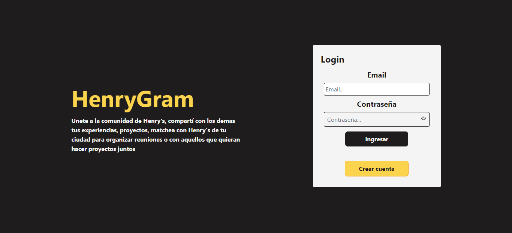

<h1 align="center">
  HenryGram
</h1>

App Web de una Red Social que tiene como objetivo, contactar y generar mayor interacción entre usuarios de la comunidad del Bootcamp Henry, mejorando los enlaces entre reclutador y programador, programar eventos, chatear con tus mejores amigos y contarle tus nuevos conocimientos a la comunidad. [HenryGram](https://henry-gram-client.vercel.app/)

## Tecnologías usadas

- React
- Redux
- Socket.io
- Local Storage
- NodeJS
- Express
- Mongoose

## Integrantes

- Diego Apolo https://github.com/DiFernando11
- Ignacio Berridy https://github.com/NachoBerridy
- Facundo Martinez https://github.com/FacundoMartinez14
- Luis Lazarte https://github.com/luiz-22

https://vimeo.com/786035296